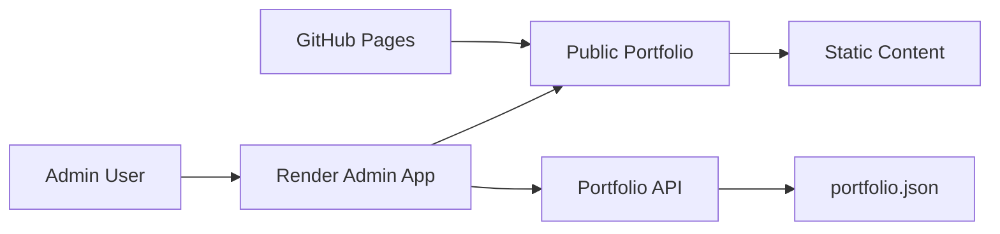

# Static Portfolio Website

This repository contains the public portfolio website hosted on GitHub Pages and the private admin app used to manage the portfolio content.

## Quick start

```bash
# Start a local preview of the public portfolio
python -m http.server 8000
```

Then open:

```text
http://localhost:8000
```

## Project structure

- `index.html` – public portfolio page
- `portfolio-data.js` – default portfolio data used as fallback
- `dummy-profile.jpg` – profile image
- `node-admin-app/` – private admin app used to edit portfolio content

## Architecture



## Public portfolio

The public portfolio is a static HTML/CSS/JavaScript site designed for GitHub Pages.

### Features
- Modern hero section
- About, projects, experience, and contact sections
- Dark mode toggle
- Download resume as PDF
- Chart-based skill overview
- GitHub profile link and profile image

### Local preview

Open the project in a browser directly or serve it with a local static server:

```bash
python -m http.server 8000
```

Then open:

```text
http://localhost:8000
```

### Deployment

This site is deployed to GitHub Pages. Push the latest changes to the GitHub Pages repository and GitHub will publish the static site.

### GitHub Pages setup

1. Push the static project to the GitHub repository used for your GitHub Pages site.
2. In GitHub, open the repository settings.
3. Go to Pages.
4. Select the branch to publish, usually `main`.
5. Save the settings.
6. The site will be published at:

```text
https://<username>.github.io/<repository-name>/
```

## Admin app

The admin app is a private Node.js + Express application used to update the portfolio content.

### Location

```text
node-admin-app/
```

### Features
- Secure admin login
- Edit portfolio info in a form
- Save updates to the portfolio data
- Serve content for the public portfolio

### Setup

From the `node-admin-app` folder:

```bash
npm install
```

Create an environment file or set the environment variable:

```bash
ADMIN_PASSWORD=Arnold@123
```

Start the app:

```bash
npm start
```

Then open:

```text
http://localhost:3000/admin
```

### Deployment

This app is intended to be deployed on Render or another private hosting platform.

### Render setup

1. Create a new Web Service in Render.
2. Connect the Render service to the repository containing the admin app.
3. Set the build command:

```bash
npm install
```

4. Set the start command:

```bash
npm start
```

5. Add the environment variable:

```bash
ADMIN_PASSWORD=Arnold@123
```

6. Deploy the service.
7. Use the generated Render URL as the private admin endpoint.

## Troubleshooting

### GitHub Pages not updating

- Wait a few minutes after pushing changes.
- Check that the repository is connected to the correct Pages branch.
- Confirm the site URL is correct.
- Hard refresh the browser to avoid cached content.

### Admin login not working

- Verify the Render environment variable is set as `ADMIN_PASSWORD`.
- Redeploy the service after changing the password.
- Check the browser console for any frontend errors.
- Ensure the admin app is the correct private app and not a stale local file.

### Password mismatch

- The password in the public site should never be stored there.
- Only the private admin app should validate the password.
- If the password does not work, update the Render environment variable and redeploy.

## Notes

- The public portfolio should remain static and safe for GitHub Pages.
- The admin app should be hosted privately, not exposed publicly in GitHub Pages.
- The admin password should be stored in environment variables rather than in front-end static files.
